# Build TinyML Model AI Voice Recognition Use TensorFlow Lite for Edge Limited Spec Device IoT (ESP32)

This application shows how to build an AI Deep Learning model (CNN) using TensorFlow to detect Tiger and Non-Tiger sounds. The model is optimized and converted to TensorFlow Lite so it can run on edge IoT devices with limited specs, like the ESP32 microcontroller.

Table of Contents
- [Build TinyML Model AI Voice Recognition Use TensorFlow Lite for Edge Limited Spec Device IoT (ESP32)](#build-tinyml-model-ai-voice-recognition-use-tensorflow-lite-for-edge-limited-spec-device-iot-esp32)
  - [Project Structure](#project-structure)
  - [Architecture](#architecture)
  - [Getting Started](#getting-started)
  - [Deploy to ESP32](#deploy-to-esp32)


## Project Structure
```
ai-voice-recognize/
├── ai/
│   ├── training-ml.py           # Train and convert the model
│   ├── run_tflite.py           # Test the TFLite model
│   ├── requirements.txt        # Python dependencies
│   ├── tiger_audio_model.tflite# Trained model (TFLite)
│   ├── tiger_audio_model.h     # Model as C array for ESP32
│   ├── sample-voice-tiger/     # Tiger audio data
│   ├── sample-voice-no-tiger/  # Non-Tiger audio data
├── micro-controller/
│   ├── main.ino                # Arduino/ESP32 inference code
```

## Architecture

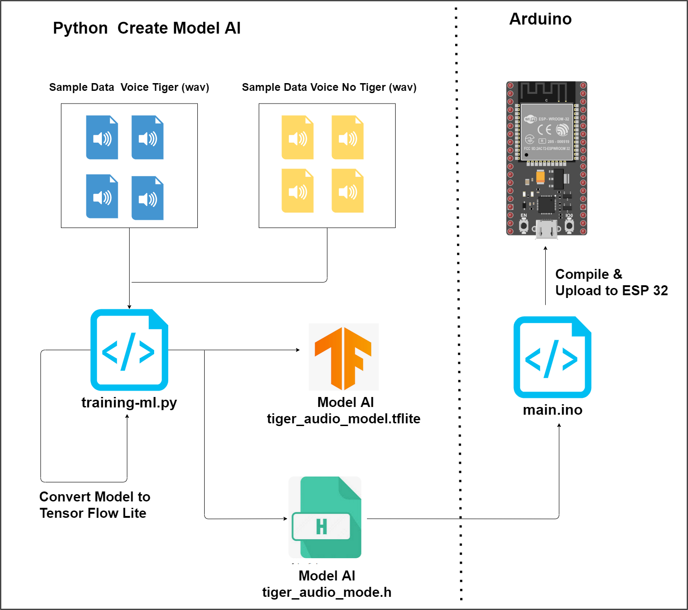

1. **Data Collection**: Collect Tiger and Non-Tiger sounds, save them in sample-voice-tiger and sample-voice-no-tiger folders.
2. **Preprocessing**: Extract MFCC features from audio so the model input is consistent. convert audio to numeric 
3. **Model Training**: Train a Deeplearning CNN model in Python using TensorFlow.
4. **Model Conversion**: Convert the model to TFLite and C array so it can run on ESP32.
5. **Testing**: Test the model on PC (run_tflite.py) and check the accuracy.
6. **Deployment**: Deploy the model to ESP32 and run real-time sound inference.
7. **Result**: ESP32 can detect Tiger/Non-Tiger sounds with AI directly on the device.


## Getting Started

**1. Install Python and dependencies:**

   ```
   pip install -r ai/requirements.txt
   ```


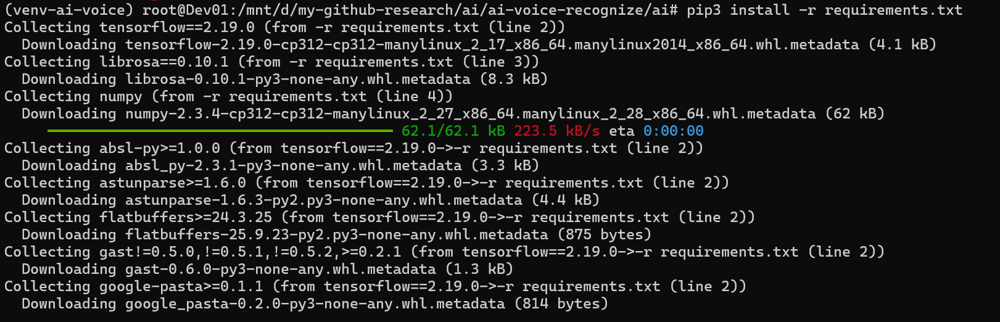

**2. Run training:**

   ```
   python ai/training-ml.py
   ```

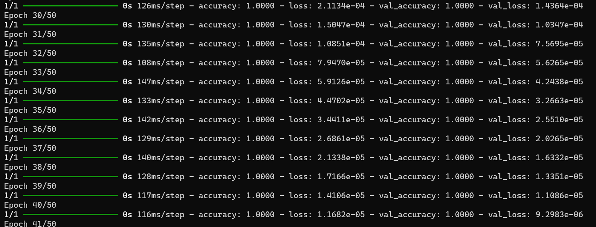


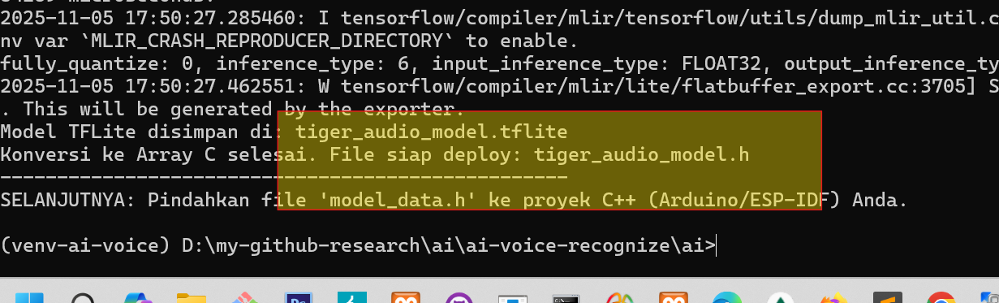


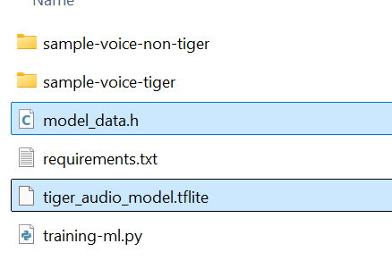


**3. Test the model:**

   ```
   python ai/run_tflite.py --mic
   # or
   python ai/run_tflite.py <audio_file.wav>
   ```

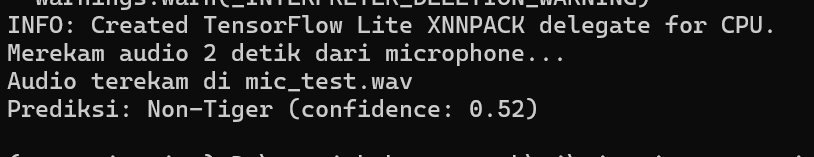

**4. Deploy the model to ESP32 as shown in micro-controller/main.ino.**

## Deploy to ESP32

**4.1 Move `tiger_audio_model.h` to your Arduino/ESP32 project.**

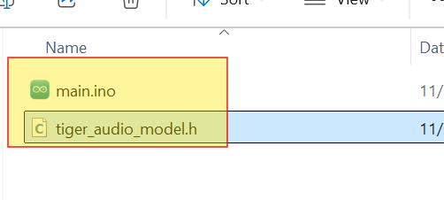

**4.2 Prepaare Arduino IDE for ESP32**

4.2.1 Include Preference Lib ESP32

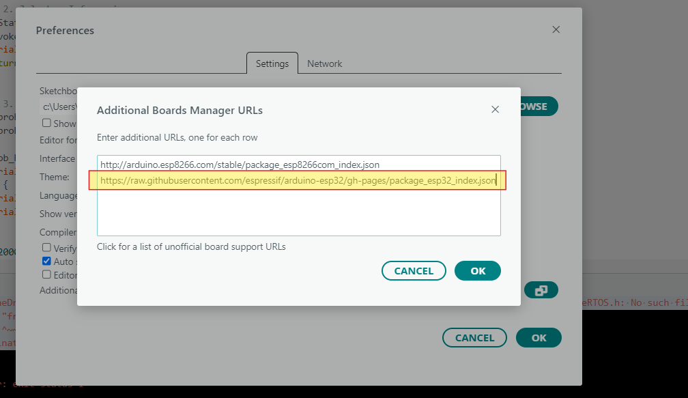


4.2.2. Include Preference Board ESP32

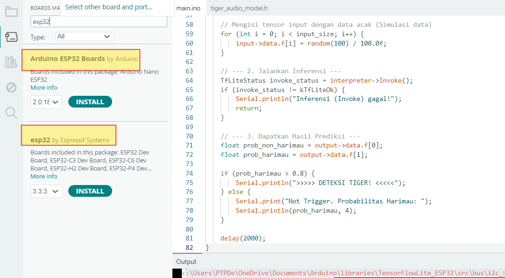


4.2.3 Include Tensorflow Lit Libray

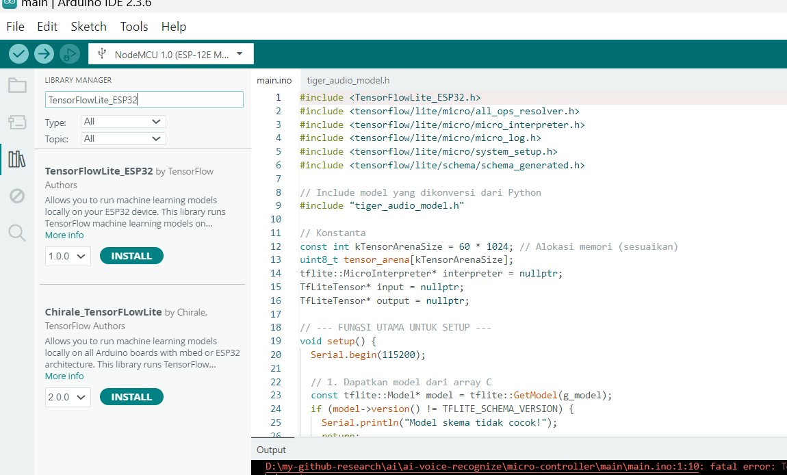


**5. Explain Code**

Follow the example code in `micro-controller/main.ino` 

5.1 Include Model AI in arduino

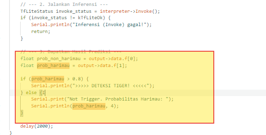


5.2 Include Model AI in arduino

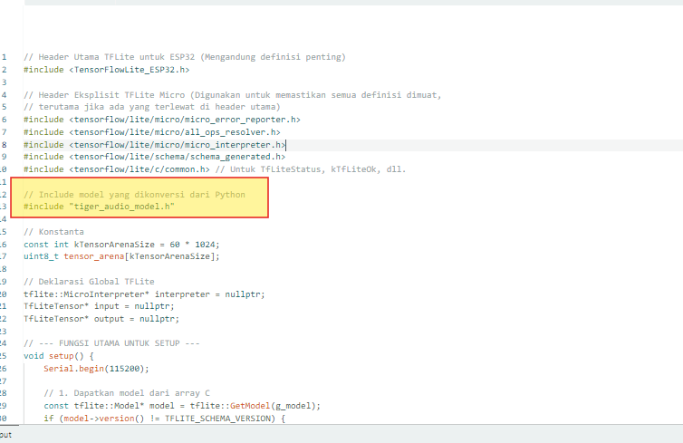


5.3 Compile & Upload to EPS32

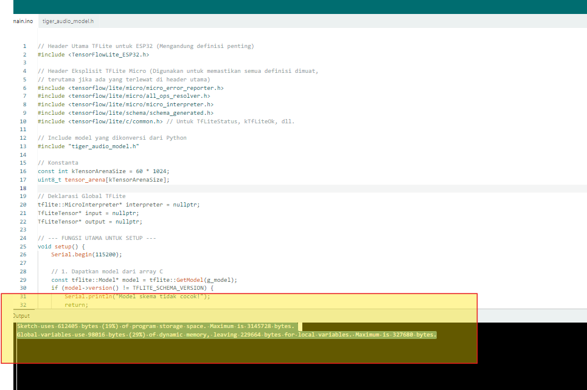


The compilation was successful and confirms your TinyML model is ready for the ESP32. The overall memory usage is very healthy:

Flash (Permanent Storage): Only 19% is used (612 KB), leaving plenty of room.
RAM (Working Memory): Uses 29% (98 KB), where the majority (60 KB) is the necessary Tensor Arena for the TFLite model to run.

In short, your model is well-optimized and fits perfectly within the ESP32's memory constraints.

